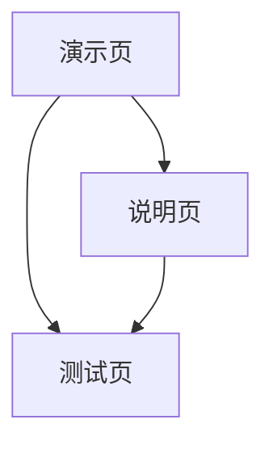

## 1. Product Overview
一个可直接在浏览器中使用的纯 TS/JS 前端组件，用于检测并展示设备充电状态与电量，采用黑白简笔画风格的 2D 电池图形。
- 目标用户为前端开发者与产品团队；组件易于嵌入 React 项目，零依赖、可扩展、可访问性良好。

## 2. Core Features

### 2.1 User Roles
| Role | Registration Method | Core Permissions |
|------|---------------------|------------------|
| 前端开发者 | 无需注册，直接以脚本引入或包依赖 | 使用组件、配置参数、集成浏览器电池 API |

### 2.2 Feature Module
我们的组件需求由以下最少页面构成：
1. **组件演示页**：电池外框、绿色电量填充、充电时黄色闪电、实时状态指示。
2. **集成说明页**：使用方法、属性配置（颜色/尺寸/内边距/显示电量）、事件说明与回退策略。
3. **集成测试页**：手动覆盖 charging 与 level 的控件，观察 UI 更新与 aria-label 变化。

### 2.3 Page Details
| Page Name | Module Name | Feature description |
|-----------|-------------|---------------------|
| 组件演示页 | 电池外框（黑白简笔画） | 绘制圆角矩形外框，黑色描边（#000），透明填充，右侧端子矩形，大小可调。 |
| 组件演示页 | 绿色电量填充 | 在外框内按 padding 与端子留白渲染绿色填充矩形（默认 #22c55e），支持按 level 比例显示（0~1）。 |
| 组件演示页 | 充电闪电指示 | 充电时显示居中黄色闪电（默认 #facc15），非充电时隐藏；路径采用 SVG 填充。 |
| 组件演示页 | 状态监听与更新 | 若支持 navigator.getBattery：监听 charging 与 level 变化事件，实时更新 SVG；不支持时保留默认并允许手动覆盖。 |
| 组件演示页 | 可访问性 | 根据状态更新 aria-label（例："Battery charging"/"Battery discharging"），确保屏幕阅读器可读。 |
| 集成说明页 | 使用方式 | 支持两种形态：Web Component（<battery-indicator>）与纯类包装（new BatteryIndicator(options)）；React 中可直接 JSX 引入或通过 useEffect 挂载。 |
| 集成说明页 | 属性配置 | 参数：width、height、colorFill、colorStroke、colorLightning、padding、showLevel；说明默认值与取值范围。 |
| 集成说明页 | 事件说明 | 自定义事件 batterychange：{ charging: boolean, level?: number }；说明触发时机与示例。 |
| 集成说明页 | 回退策略 | 不支持 Battery API 时保持默认显示，提供 setCharging() 与 setLevel() 手动覆盖；SSR 环境下延迟连接。 |
| 集成测试页 | 手动覆盖控件 | 提供开关与滑条控件，手动设置 charging 与 level，验证 UI 同步更新。 |
| 集成测试页 | 实时状态面板 | 展示当前 charging 与 level 数值、事件触发次数与最近时间戳，便于调试。 |

## 3. Core Process
- 用户（前端开发者）打开演示页，组件初始化并尝试连接浏览器电池 API。
- 若支持 Battery API：读取初始 charging/level，渲染电池与闪电；随后监听变化并实时更新。
- 若不支持 Battery API：保持默认状态，开发者可在测试页使用控件手动 setCharging()/setLevel() 验证集成。
- 在说明页查看快速集成步骤、属性与事件，完成在 React 项目中的嵌入。

## 4. User Interface Design
### 4.1 Design Style
- 主色与辅色：黑色描边 #000，绿色填充 #22c55e；充电闪电黄色 #facc15；背景透明或白色。
- 按钮风格：在测试页与说明页，使用圆角轻描边按钮（不影响组件本体）。
- 字体与字号：系统默认字体，说明页与测试页采用 14–16px 便于阅读。
- 布局风格：组件采用 SVG 居中展示；说明页为卡片式信息区；测试页为左右分栏（控件/预览）。
- 图标风格：闪电为实心几何形状；整体保持极简线条风。

### 4.2 Page Design Overview
| Page Name | Module Name | UI Elements |
|-----------|-------------|-------------|
| 组件演示页 | 电池外框 | 圆角矩形，描边 2px，端子矩形 8px 宽；SVG 尺寸默认 120x56，可缩放。 |
| 组件演示页 | 绿色填充 | 内边距 3px，填充矩形宽度按 level 比例；颜色 #22c55e；支持平滑过渡。 |
| 组件演示页 | 闪电图形 | 居中显示，填充 #facc15；在充电状态显示，非充电隐藏。 |
| 集成说明页 | 属性与事件卡片 | 轻卡片布局、标题+表格/列表；代码片段采用等宽字体。 |
| 集成测试页 | 控件与预览 | 左侧控件（开关/滑条），右侧预览面板，状态条实时更新。 |

### 4.3 Responsiveness
- 桌面优先（desktop-first），同时适配移动端；基本的触摸交互优化（滑条可触控）。
