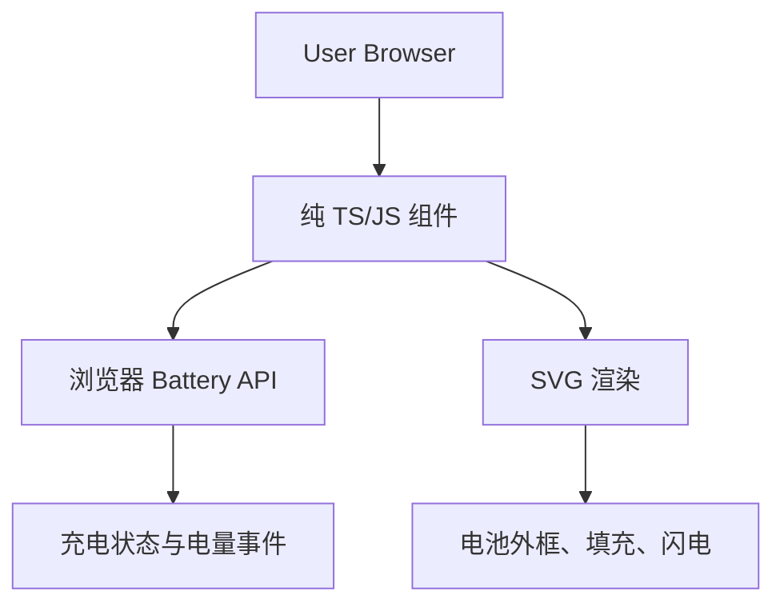

## 1. Architecture design


## 2. Technology Description
- 前端：TypeScript + Vite（构建）
- 初始化工具：vite-init
- 后端：无（纯前端组件，零依赖）
- 构建输出：ESM + UMD，附带 .d.ts 类型声明

## 3. Route definitions
| Route | Purpose |
|-------|---------|
| / | 组件演示页，展示电池状态与实时更新 |
| /guide | 集成说明页，属性、事件、使用示例 |
| /test | 集成测试页，手动覆盖充电与电量，验证更新 |

## 4. API definitions
### 4.1 组件属性与事件（TypeScript 类型）
```typescript
interface BatteryIndicatorProps {
  width?: number | string;          // 默认 120
  height?: number | string;       // 默认 56
  colorFill?: string;              // 默认 '#22c55e'
  colorStroke?: string;            // 默认 '#000'
  colorLightning?: string;         // 默认 '#facc15'
  padding?: number;                // 默认 3
  showLevel?: boolean;             // 默认 true
  autoConnect?: boolean;           // 默认 true，自动连接 Battery API
}

type BatteryChangeEvent = {
  charging: boolean;
  level?: number;                  // 0~1，若 API 不可获取则为 undefined
};
```

### 4.2 公共方法（Web Component 与纯类均提供）
```typescript
connectBattery(): Promise<void>;
setCharging(isCharging: boolean): void;
setLevel(level: number): void;     // level ∈ [0, 1]
destroy(): void;                  // 解绑事件，清理 DOM
```

## 5. Server architecture diagram
不适用（纯前端组件，无后端服务）。

## 6. Data model
不适用（无持久化数据库，仅实时状态）。

## 7. 构建与发布
- 使用 Vite + TypeScript 编译，输出 dist/ 目录：
  - battery-indicator.esm.js
  - battery-indicator.umd.js
  - index.d.ts（类型声明）
- 支持通过 CDN 引入 UMD，或 npm 安装后 import ESM。